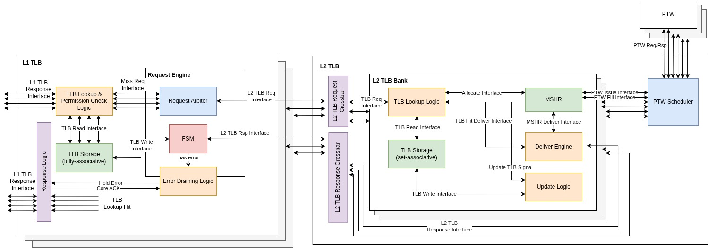

# Memory Management Unit (MMU)

This repository provides a multi-level, multi-port Memory Management Unit for a
many-core RISC-V GPU. It performs virtual-to-physical address translation under
both the 32-bit (Sv32) and 39-bit (Sv39) page-based virtual-memory schemes,
selected at build time by `XLEN` (see `includes/mmu_pkg.sv`).

The MMU is organised in three layers connected exclusively by uniform
`valid`/`ready` handshakes:

1. a per-core, per-lane **L1 TLB** (small, fully associative),
2. a **shared, banked, set-associative L2 TLB** that caches leaf PTEs and
   coalesces misses, and
3. a **Page Table Walker (PTW)** pool with a Page Walk Cache.

The top module `mmu` (`rtl/mmu.sv`) instantiates one iTLB and one dTLB per core, a
single shared L2 frontend, and a PTW pool. The design is parameterised
(`NUM_CORES`, `NUM_BANKS`, `NUM_PTWS`, TLB sets/ways, MSHR depth).

	

## Interfaces

Every inter-module link is a `valid`/`ready` interface carrying a payload struct; a
transfer occurs on the single cycle that `valid && ready`. The producer holds the
payload stable until the fire (a *fire-once* contract), `valid` never depends on
the matching `ready`, and a `ready` may depend on the other channel's `valid` but
never on its own — keeping the layers free of combinational loops.

| Interface | Endpoints | Notes |
|---|---|---|
| `core_tlb_if`  | core ↔ L1     | per-request `priv_lvl`, `vm_enable` |
| `inter_tlb_if` | L1 ↔ L2       | plus a broadcast `invalidate_tlb` |
| `ptw_if`       | L2 ↔ PTW      | carries a routing `tag` |
| `ptw_mem_if`   | PTW ↔ memory  | PTE read/write; `rsp_error` for access faults |

`invalidate_tlb` is a standalone broadcast (SFENCE / SATP write), not matched to
any request, and flushes consumer storage. Each request also carries a per-request
`vm_enable`, so an access can bypass translation without a global mode switch.

## L1 TLB (`rtl/tlb/multiport_tlb`)

Private to a core and probed by all of that core's lanes in parallel.

- Fully-associative parallel CAM (`tlb_storage_parallel_cam`): every lane compares
  against every entry in the same cycle.
- *Page-size aware* matching: a leaf at level `l` compares only the top
  `(l+1)·PAGE_LVL_BITS` VPN bits, so one entry covers an entire superpage.
- Reference-matrix (ordering-matrix) LRU for cheap concurrent recency updates.
- A request engine (`l1_tlb_request_engine`) serialises misses onto the single L2
  link, keeps one walk outstanding, and coalesces lanes missing the same VPN.
- Per-lane permission check (`pte_perm_check`) rides the hit path; a store to a
  clean writable page deliberately misses so the walk can set the dirty bit.

## L2 TLB (`rtl/tlb/banked_tlb`)

Shared by all cores; caches leaf PTEs and coalesces concurrent misses.

- *Banked* (`l2_tlb_frontend`): requests scatter to banks by the low VPN bits and
  responses gather back via a threaded source id.
- Each bank (`l2_tlb_bank`) has set-associative storage
  (`tlb_storage_set_associative`, explicit-rank LRU), a non-blocking MSHR
  (`l2_tlb_mshr`) that coalesces same-VPN misses and runs a two-pass clean/dirty
  lifecycle, and a broadcast response engine.
- A stateless `ptw_scheduler` pairs each bank's pending walk with a free PTW and
  self-routes responses by a `bank` tag field.

## Page Table Walker (`rtl/ptw`)

- `ptw` walks the radix page table from the SATP root to a leaf (or a fault), one
  memory read per uncached level over `ptw_mem_if`, single walk outstanding.
- Level count and PTE size follow `XLEN` (Sv32: 2 levels, 4-byte PTEs; Sv39: 3
  levels, 8-byte PTEs). Misaligned superpages are rejected.
- On a dirtying store the leaf PTE's A/D bits are written back to its own address.
- `ptw_cache` (Page Walk Cache) caches non-leaf PTEs by physical address so a
  later walk skips upper-level reads.

## Vortex adapters (`rtl/vortex_adapter`)

Thin shims that integrate the MMU into the Vortex pipeline:

- `VX_mmu` — top wrapper; instantiates `mmu` plus the adapters below.
- `tlb_vxcore_adapter` — bridges the pipeline's `VX_addr_trans_if` to `core_tlb_if`
  (VA↔VPN/offset, PPN→PA, exception mapping; one iTLB port per core and one dTLB
  port per LSU lane).
- `ptw_vxdcache_adapter` — bridges `ptw_mem_if` to `VX_mem_bus_if` (word-offset
  handling, posted PTE write-backs, response slicing).
